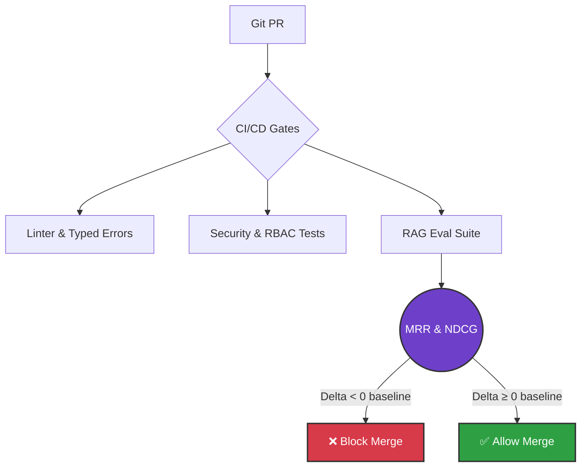
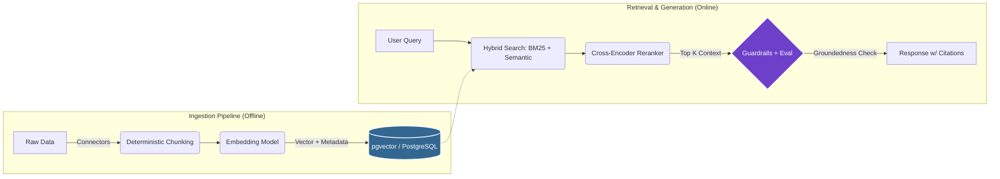

<h1 align="left">Santiago Vicente Scacciaferro Wyss 👋</h1>

<h3 align="left">
  GenAI & Systems Engineer · <b>Production-Grade RAG</b> · <b>Secure Systems</b> · <b>Observability</b>
</h3>

  <i>“I build AI systems where evaluation isn't an afterthought, but the foundation — pro engineering over fragile demos.”</i>

  
  
  
  

  
  
  
  

---

<table>
<tr>
<td width="62%" valign="top">

<h2>🧠 About Me</h2>

  I’m a <b>4th-year Systems Engineering</b> student at <b>UTN FRRe</b>, building systems where <b>quality</b>, <b>security</b>, and <b>measurement</b> are non-negotiable.

  <b>⚙️ GenAI / RAG Engineering</b> 
  Hybrid retrieval, reranking, and grounded generation with citations.

  <b>📏 Evaluation-First</b> 
  MRR / Recall@k / NDCG, reproducible suites, CI regressions tracked by commit/SHA.

  <b>🛡️ Security-First</b> 
  RBAC/ACL, scoped access (anti-IDOR), defensive limits (fail-fast, anti-OOM).

  <b>🧱 Architecture</b> 
  Clean / Hexagonal, SOLID/GRASP, strict boundaries, typed errors.

  <b>🔭 Workflow & Observability</b> 
  WSL/Linux, structured logging, deterministic offline-first tooling, strict PR discipline (1 capability = 1 PR).

</td>
<td width="38%" valign="top">

<h2>📊 GitHub</h2>

  

<h2>🧰 Tech Stack & Tools</h2>

  
  
  
  
  
  
  
  
  
  

</td>

</tr>
</table>

---

<h2>🛠️ Core Engineering Principles</h2>

<ul>
  <li><b>🎯 Data-Driven Optimization</b> — measurable deltas, not intuition. Benchmarks tracked by commit/SHA; if it doesn’t improve metrics, it doesn’t merge.</li>
  <li><b>🧭 Architecture Rigor</b> — Clean/Hexagonal + SOLID/GRASP. Business logic fully decoupled from vendors (LLMs / Vector DBs).</li>
  <li><b>🧨 Security by Design</b> — prompt injection defense, granular access control (RBAC/ACL), data-leak mitigation (anti-IDOR).</li>
  <li><b>🧪 CI/CD & Repo Discipline</b> — contracts, types, tests, and performance regressions validated in CI; small incremental PRs.</li>
</ul>

---

<!-- =======================
     RAG CORP — BOXED SECTION
     ======================= -->

<table>
<tr>
<td valign="top">

<h2>🧠 RAG Corp</h2>

  <b>Production-grade RAG platform</b> focused on <b>evaluation</b>, <b>security</b>, and <b>scale</b>.

  
  

<table>
<tr>
<td width="56%" valign="top">

<h3>What it does</h3>

<ul>
  <li><b>Ingestion</b>: deterministic pipeline + connectors</li>
  <li><b>Retrieval</b>: hybrid (semantic + BM25) + reranking</li>
  <li><b>Grounded answers</b>: citations-first generation</li>
  <li><b>Evaluation gates</b>: regression checks before merge</li>
  <li><b>Defensive limits</b>: fail-fast, anti-OOM, scoped access (anti-IDOR)</li>
</ul>

<h3>RAG Evaluation Stack</h3>

| Layer          | Target metrics                        | Methodology               |
| :------------- | :------------------------------------ | :------------------------ |
| **Retrieval**  | MRR, Recall@k, NDCG, Latency          | Benchmarks + ablations    |
| **Reranking**  | Win-rate, NDCG lift                   | Baselines + comparisons   |
| **Generation** | Groundedness, Faithfulness, Relevance | LLM-as-a-judge + datasets |
| **System**     | Cost, Limits, Error rate              | Observability + defenses  |

</td>
<td width="44%" valign="top">

<h3>Evaluation-First CI/CD</h3>

<h3>Production RAG Architecture</h3>

</td>
</tr>
</table>

<h3>Tech stack used</h3>

  
  
  
  
  
  
  
  

</td>
</tr>
</table>

<!-- =======================
     END RAG CORP — BOXED SECTION
     ======================= -->

---

<h2>💬 Languages</h2>

<ul>
  <li>🇪🇸 <b>Spanish</b>: Native</li>
  <li>🇺🇸 <b>English</b>: Professional working proficiency (C1 / technical)</li>
</ul>
